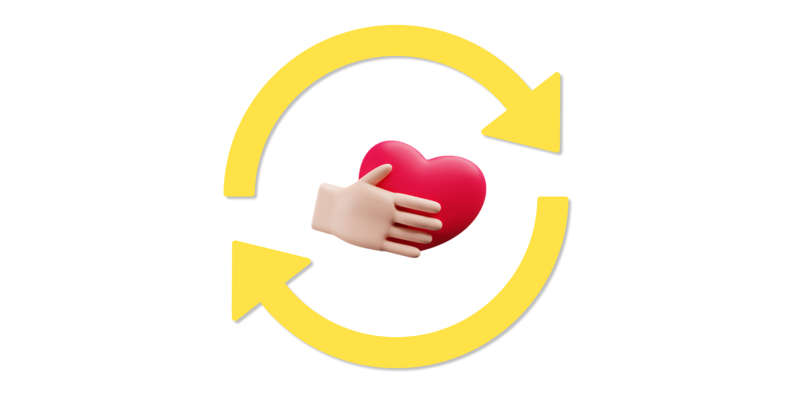

### **Inspiration:**

A quarter of all Canadian adults are hypertensive, which is a primary determinant for stroke and heart diseases. By adopting a healthy lifestyle, these risks can be eliminated. Our website considers a wide variety of lifestyle components, from nutrition to mental health, and allows users to implement them in their everyday lives with ease.

### **Function & Learning Process:**

By building an accessible website that helps adults or seniors monitor and manage their heart health, we have gained essential insight into healthy living. From curating nutritional recipes on the *Nutrition* page, compiling mindfulness exercises in *Games*, to understanding important risk factors for stroke and heart diseases, we have addressed each aspect of healthy living exclusively.

By collaborating in a diverse group of front-end, back-end, and UI/UX design implementers, we have gained significant technical experience in a wide variety of languages and software, namely:

- Spring Boot
- Thymeleaf Templates
- Spring Web
- Lombok Annotations
- Figma
- JavaScript (JQuery)
- HTML
- CSS

### **Accomplishments & Building Process:**

1.  UI/UX design brainstorming in *Figma Wireframe* to accommodate for ease and simplicity when navigating a website, especially since it is aimed towards adults and seniors.
    
2.  Creation of the main webpage with exclusive health features (nutrition, games, music, chatbox, etc.) embedded in the website.
    
3.  Creation of individual features:
    
-   ***Nutrition***: A compilation of *The Candian Food Guide*, nutritional recipes, and healthy diet options.

-   ***Games***: *Heartagrams* and *Heart Tac Toe*, alongside a health quiz for users to *educate* themselves on the importance of a healthy lifestyle.
    
-   ***Health***: Resources for managing physical and mental health; stress management and easy exercise tips.
    
-   ***Music***: A designated meditative space for a calming and restful user experience.
    
-   ***Chatbot***: A smart response bot with answers to frequently asked questions, readily available to users 24/7.
    

### **Challenges & Next Steps:**

1.  We wanted to embed a machine learning feature into the chatbot to make it more responsive and accurate to asked prompts, however, we were limited by time and the resources needed to complete it.
    
2.  Within the *Games* subcategory, we created a word search prototype that allowed users to sharpen their cognitive abilities via concentration. However, the game required a complex visual representation using highlighting and selection features which created a barrier in the developing process.
    
Given the necessary resources and time, our future strategy is to implement a diverse database of prompts and responses from the chatbot, alongside increasing its accuracy. We can further develop the cognitive learning aspect of the website by including a variety of games that can be daily exercises for mental health.  

### **References:**

*1.  MyFitnessPal Low-Fat Food Recipes*
    
*2.  The Canadian Food Guide*
    
*3.  Heart & Stroke Foundation FAQs and Mission Statement*
